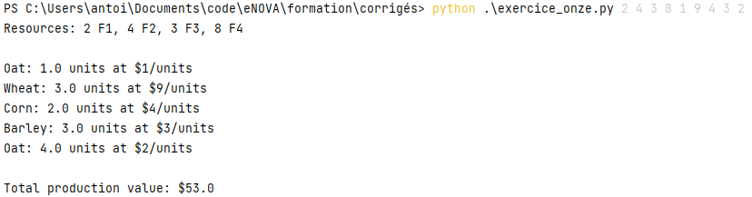

# Partie 1 : Formation simple Python

### Axe un : syntaxe de Python

Python est un langage de programmation de haut niveau, interprété et multiplateforme,
qui est largement utilisé pour la science des données, l'apprentissage automatique,
le développement web et bien plus encore.
Voici une présentation rapide de la syntaxe de base de Python.

### Axe deux : les variables

Les variables sont utilisées pour stocker des valeurs dans un programme. 
En Python, vous pouvez déclarer une variable en assignant une valeur à un nom. Par exemple :

```
x = 5
y = "Hello, world!"
```

Dans cet exemple, x est une variable qui stocke la valeur entière 5,
et y est une variable qui stocke la chaîne de caractères "Hello, world!".


### Axe trois : les opérateurs

Les opérateurs sont utilisés pour effectuer des opérations sur des variables. Voici quelques-uns des opérateurs les plus
couramment utilisés en Python :
````
+:addition
-: soustraction
*: multiplication
/ : division
// : division entière
% : modulo (reste de la division entière)
** : exposant
````

Voici un exemple d'utilisation d'opérateurs :
````
a = 10
b = 3
c = a + b     # addition
d = a - b     # soustraction
e = a * b     # multiplication
f = a / b     # division
g = a // b    # division entière
h = a % b     # modulo
i = a ** b    # exposant
````

### Axe quatre : les fonctions

Les fonctions sont des blocs de code qui effectuent une tâche spécifique.
En Python, vous pouvez définir une fonction en utilisant le mot-clé def.
Voici un exemple de définition de fonction :
````
def addition(a, b):
    c = a + b
    return c
````

Dans cet exemple, nous avons défini une fonction simple addition qui prend deux arguments a et b et renvoie leur somme.
Il est possble de créer des fonctions plus complexes, que nous verrons plus tard.

### Axe cinq : les structures de contrôle

Les structures de contrôle sont utilisées pour contrôler le flux d'exécution d'un programme.
Voici quelques-unes des structures de contrôle les plus couramment utilisées en Python :

````
if : exécute un bloc de code si une condition est vraie
else : exécute un bloc de code si la condition de if est fausse
elif : exécute un bloc de code si une autre condition est vraie
while : exécute un bloc de code tant qu'une condition est vraie
for : exécute un bloc de code pour chaque élément d'une liste ou d'un itérateur
````
Voici un exemple d'utilisation de la structure de contrôle if :

````
x = 5
if x > 0:
    print("x est positif")
elif x == 0:
    print("x est nul")
else:
    print("x est négatif")
    
````

Dans cet exemple, nous avons utilisé la structure de contrôle if pour afficher un message différent selon que la
variable x est positive ou négative.


# Partie 2 : Exercices de calculs en Python


### Exercice 1 : Conversion de température

Écrivez un programme Python qui demande à l'utilisateur d'entrer une température en degrés Celsius,
puis convertit cette température en degrés Fahrenheit et affiche le résultat.

La formule de conversion est la suivante :
``
F = (C * 9/5) + 32
``

### Exercice 2 : Calcul de l'aire d'un cercle

Écrivez un programme Python qui demande à l'utilisateur de saisir le rayon d'un cercle,
puis calcule et affiche l'aire de ce cercle.

La formule pour calculer l'aire d'un cercle est la suivante :
``
A = pi * r^2
``

où pi est une constante mathématique qui représente la valeur de pi (environ 3,14) et r est le rayon du cercle.

### Exercice 3 : Calcul de la moyenne

Écrivez un programme Python qui demande à l'utilisateur de saisir trois nombres,
puis calcule et affiche leur moyenne.

### Exercice 4 : Vérification de parité

Écrivez un programme Python qui demande à l'utilisateur de saisir un entier,
puis vérifie si cet entier est pair ou impair et affiche le résultat.

### Exercice 5 : Calcul de la somme des entiers
Écrivez un programme Python qui demande à l'utilisateur de saisir un entier, puis calcule la somme de tous les entiers
de 1 à cet entier et affiche le résultat.

### Exercice 6 : Calcul de la moyenne

Écrivez un programme Python qui prend une liste de nombres en entrée et calcule leur moyenne.

### Exercice 7 : Vérification de la validité d'un mot de passe

Écrivez un programme Python qui demande à l'utilisateur de saisir un mot de passe et vérifie s'il est valide.
Un mot de passe est considéré comme valide s'il remplit les conditions suivantes :
- Avoir une longueur minimale de 8 caractères,
- Contenir au moins une lettre majuscule, une lettre minuscule, un chiffre et un caractère spécial (par exemple, !,
@, #, $)
- Pour vous aider, voici la ligne qui va définir la validité du mot de passe :
``pattern = “^(?=.*[a-z])(?=.*[A-Z])(?=.*\d)(?=.*[@$!%*?&])[A-Za-z\d@$!%*?&]{8,}$”``


### Exercice 8 : Jeu de devinette de nombre

Écrivez un programme Python qui génère un nombre aléatoire entre 1 et 100 et demande à l'utilisateur de deviner le
nombre.
Si l'utilisateur devine correctement, le programme affiche "Bravo !" et s'arrête.
Sinon, le programme donne un indice (plus grand ou plus petit) et demande à l'utilisateur de deviner à nouveau jusqu'à
ce qu'il trouve le bon nombre.

### Exercice 9 : Jeu de devinette de mot
Écrivez un programme Python qui choisit un mot aléatoire dans une liste prédéfinie et demande à l'utilisateur de deviner
le mot.
Si l'utilisateur devine correctement, le programme affiche "Bravo !" et s'arrête. Sinon, le programme donne un indice
(par exemple, la première lettre) et demande à l'utilisateur de deviner à nouveau jusqu'à ce qu'il trouve le bon mot.
Voici un exemple de code pour vous aider à démarrer :

### Exercice 10 : Création d'un gestionnaire de tâches
Écrivez un programme Python qui permet à l'utilisateur de créer une liste de tâches et de les gérer.
Le programme doit permettre à l'utilisateur de :
- Ajouter une tâche
- Afficher toutes les tâches
- Supprimer une tâche
- Marquer une tâche comme terminée

### Exercice 11 : Le fermier
Cet exercice est plus complexe que les précédents et utilise les connaissances théoriques acquises ainsi
que de bonnes connaissances en mathématique. Il se peut que vous deviez utiliser l'algorithme de Gauss, des matrices ou
tout algorithme qui pourrait vous être utile à résoudre le problème le plus efficacement possible.

Un agriculteur cultive des céréales : de l'avoine, du blé, du maïs, de l'orge et du soja.
Il utilise quatre types différents d'engrais (F1, F2, F3 et F4),
dans les quantités suivantes (par tonne d'engrais pour produire une unité de céréales) :

|        | F1  | F2  | F3  | F4  |
|--------|-----|-----|-----|-----|
| avoine | 1   | 1   | 2   | 0   |
| blé    | 0   | 2   | 1   | 0   |
| maïs   | 1   | 0   | 0   | 3   |
| orge   | 0   | 1   | 1   | 1   |
| soja   | 2   | 0   | 0   | 2   |

En gardant à l'esprit qu'il dispose de quantités limitées d'engrais chaque année,
l'agriculteur aimerait optimiser sa production en fonction des prix des céréales.
Vous allez donc développer un programme qui prendra en paramètre les ressources en engrais et les prix de chaque type de
céréale. Le programme affichera les quantités à produire, ainsi que la valeur totale de sa production.
La sortie devrait ressember à ça :



### Exercice 12 : Ouvrir et lire un fichier texte

Ecrivez un programme Python qui est capable d'ouvrir puis lire des mots et calcule le nombre de caractères de chaque
mot. Le programme doit ensuite afficher le contenu du fichier.

Conseil : documentez vous sur open() et read().

### Exercice 13 : Manipulation de fichier

Ecrivez un programme Python qui vous permettra de créer, écrire et lire un fichier. Le fichier texte aura pour nom
``"exercice_treize.txt"`` et sera dans le même répertoire que votre programme Python.
Une fois qu'il sera créé, vous ajouterez trois phrases dedans, chacune à la ligne :
- "Hello world!"
- "exercice de la posterite!"
- "Goodbye World!"

Une fois ces phrases écrites, vous fermerez le fichier t le rouvrirez en mode lecture pour afficher le contenu écrit.

Bonus : Utilisez la fonction "with" pour gérer la fermeture automatique du fichier après avoir fini de l'utiliser.

Contraintes :

Utilisez des fonctions prédéfinies pour manipuler les fichiers.
Les phrases doivent être écrites dans l'ordre indiqué dans les instructions.
La nouvelle ligne doit être créée en utilisant le caractère de retour à la ligne "\n".
Le contenu du fichier doit être affiché en utilisant une boucle.
Évitez d'utiliser des chemins d'accès absolus pour le fichier.

### Exercice 14 : Ecriture dans un fichier

Ecrivez un programme Python qui vous permettra d'écrire dans un fichier les résultats obtenus dans les exercices 1 à 6.
Voici un exemple du contenu que le fichier devra afficher : 
````text
Exercice 1 : <résultat>
Exercice 2 : <résultat>
Exercice 3 : <résultat>
Exercice 4 : <résultat>
Exercice 5 : <résultat>
Exercice 6 : <résultat>
````

Ou ``<résultat>`` devra être le résultat trouvé par le programme de l'exercice en question. Vous pouvez réutiliser et
modifier le code précédemment écrit pour pouvoir compléter cet exercice. L'utilisation des fonctions est préconisée pour
plus de facilité ! 
Une fois les résultats écrit dans le fichier, le programme lira le fichier en sortie.


### Exercice 15 : Copier le contenu d'un fichier
Ecrivez un programme Python qui vous permettra de copier le contenu d'un fichier à l'autre. Vous devrez ouvrir le
fichier en lecture, lire le contenu et l'écrire dans le nouveau fichier, puis fermer les deux fichiers. Une fois les
deux fichiers fermés, vous devrez lire le contenu du second fichier.

### Exercice 16 : Calcul et lecture d'un fichier CSV

Pour cet exercice, vous aurez besoin de deux bibliotèques externes : csv et statistics. Si elles ne sont pas installées,
référez-vous au tutoriel pip si vous ne savez pas comment les installer.

Ecrivez un programme Python qui permettra à l'utilisateur de lire un fichier CSV et de choisir entre afficher ou
effectuer un traitement sur les données. Le programme demandera à l'utilisateur de spécifier le nom du fichier CSV à
lire. Après lui avoir fourni le nom du fichier, le programme propesera deu options : afficher les données ou effectuer
un traitement.

Si l'utilisateur choisit l'affichage des données, le programme affichera toutes les données du fichier CSV.

Si l'utilisateur choisit d'effectuer un traitement, le programme doit lui demander de spécifier le numéro de la colonne
sur laquelle effectuer le traitement et le type de traitement à effectuer. Les types de traitements possibles sont :
calculer la somme, la moyenne, le minimum ou le maximum des valeurs de la colonne spécifiée. Le programme doit ensuite
effectuer le traitement et afficher le résultat à l'utilisateur.


Exemple de fichier SCV : 
````text
Nom,Prenom,Age,Note
Dupont,Jean,25,12
Durand,Marc,27,16
Martin,Sophie,23,10
...
````
Exemple d'utilisation du code : 
````text
Entrez le nom du fichier CSV : notes.csv
Choisissez une option :
1. Afficher les données
2. Effectuer un traitement
> 2
Entrez le numéro de la colonne : 4
Choisissez un type de traitement :
1. Calculer la somme
2. Calculer la moyenne
3. Trouver la valeur minimale
4. Trouver la valeur maximale
> 2

Moyenne des notes : 12.8

````

### Exercice 17 :  Multiples de 3 et 5

Ecrivez un programme Python qui calcule la somme de tous les multiples de 3 et 5 en dessous d'un nombre entier donné. Le
programme doit demander à l'utilisateur d'entrer un nombre entier, puis fera le calcul de la somme de tous les multiples
de 3 et 5.

Voici un exemple d'utilisation :
````text
Entrez un nombre entier : 20
Somme des multiples de 3 et 5 en dessous de 20 : 78
````
Astuces :
- la boucle for peut vous aider.
- l'opérateur modulo peut vous aider à detmeriner si u nombre entier est un multiple de 3 ou 5.
- l'utilisation d'un variable "total" peut vous aider à stocker la somme de tous ces nombres trouvés.


### Exercice 18 : Inversion de chaine de caractères

Ecrivez un programme Python qui prendra en entrée une chaine de caractères et la renverra en sortie, mais inversée.

Exemple d'utilisation : 
````text
Entrez une phrase : Bonjour!
Sortie : !ruojnoB
````

### Exercice 19 : 

----------      


Ces exercices devraient vous aider à vous familiariser avec la syntaxe de base de Python et à commencer à coder en
Python.
Les corrigés figurent dans le dossier ```corrigés/```, d'autres exercices et une suite sera rajoutée au fur et à mesure
du temps.
Essayez de comprendre ce que veut dire chaque chose pour ne pas être perdu !
    
# Sources
````
documentaion Python :
https://www.python.org/
https://www.python.org/doc/
Documentation pip (packet manager)
https://pypi.org/project/pip/
PyCharm Community :
https://www.jetbrains.com/edu-products/download/other-PCE.html
installation Git:
https://git-scm.com/book/fr/v2/D%C3%A9marrage-rapide-Installation-de-Git
````